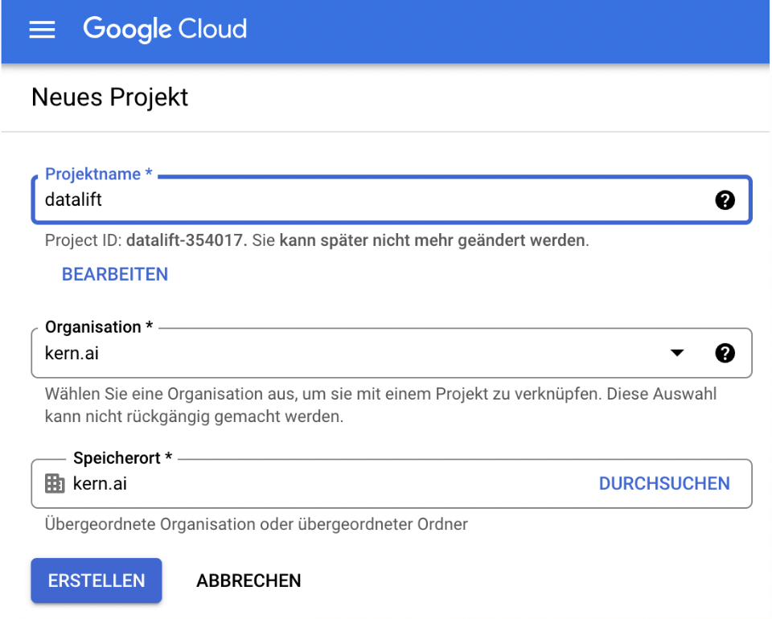
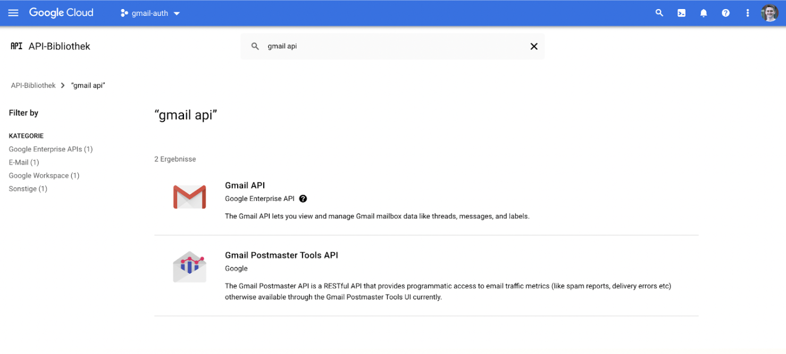
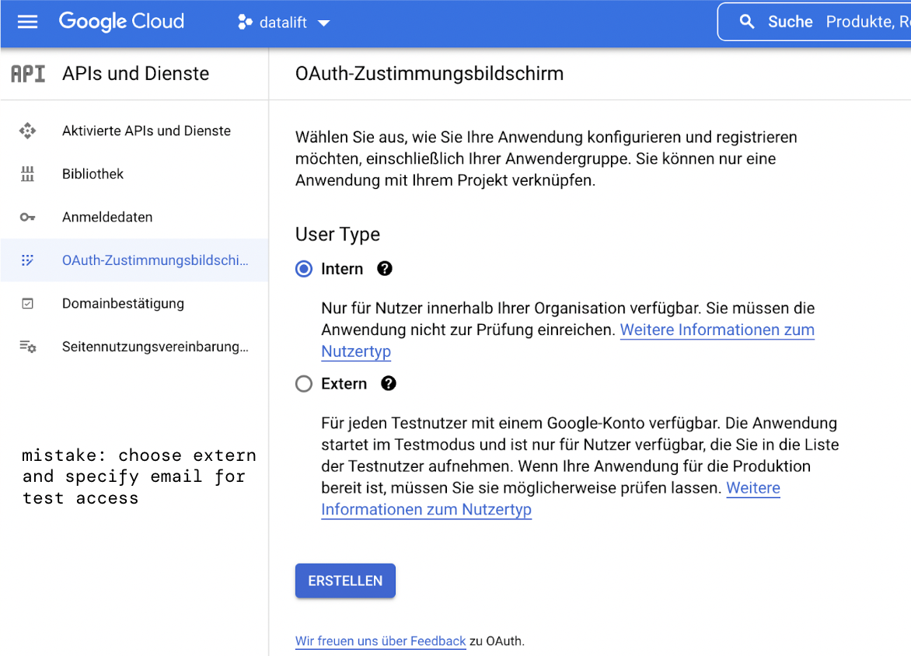
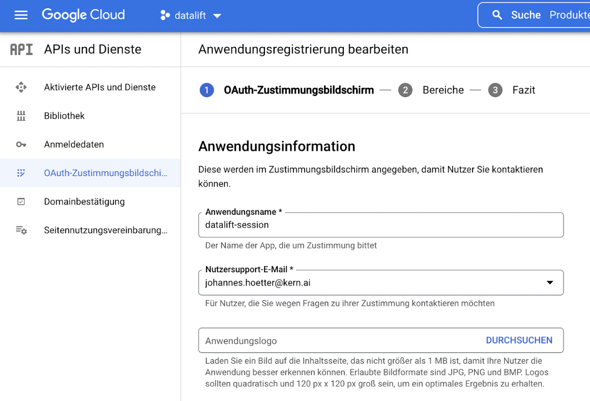
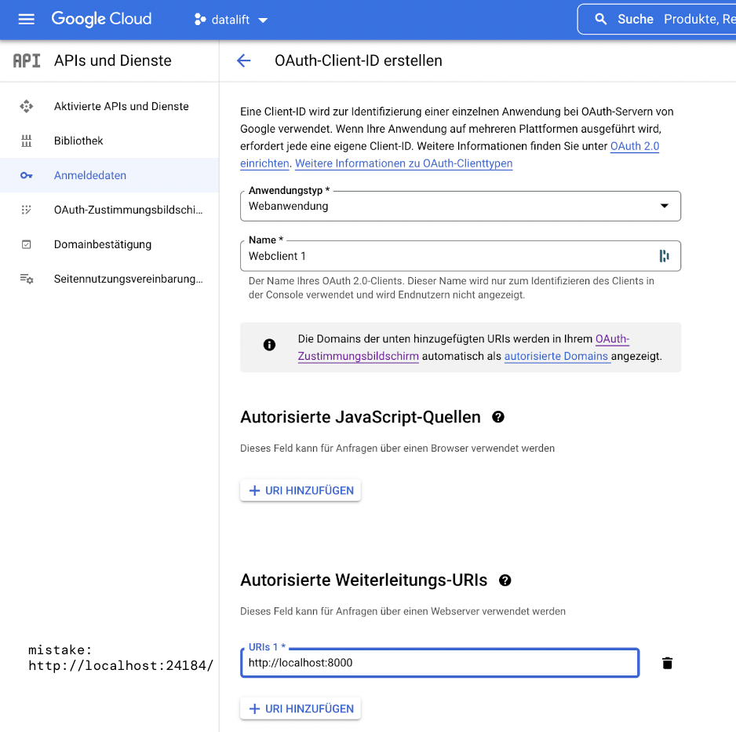

# Integrating with GMail via oauth2

In this section, you can learn how to integrate a GMail inbox using oauth2. We've separated this from the rest of the repository also w.r.t. the requirements, as this is something that can differ from participant to participant. If you have any troubles with this task at home, please reach out to us anytime :)

# Table of contents
  - [0 Setup GCP account](#0-setup-gcp-account)
  - [1 Setup GCP project](#1-setup-gcp-project)
  - [2 Activate GMail API](#2-activate-gmail-api)
  - [3 Create a consent screen](#3-create-a-consent-screen)
  - [4 Creating credentials](#4-creating-credentials)
  - [5 Integrating via Python](#5-integrating-via-python)

## 0 Setup GCP account
At first, you need to [create](https://console.cloud.google.com/) a Google Cloud Platform (GCP) account. It is completely for free, and you typically receive lots of credits to play around with. 

## 1 Setup GCP project
After you've successfully created a GCP account, you now need to create a new project:


## 2 Activate GMail API
In this project, go to the library section and search for the GMail API. Activate it for your project:


## 3 Create a consent screen
After you've done that, you can start creating the consent screen for your oauth2 Application. The consent screen will be shown to a user once you start the `app.py` script afterwards. GMail will use the selected account from the consent screen for authorization.

First, select that you want an external user. You must also provide a testuser e-mail for this (bound to a Gmail account that can be used for the consent screen).


After that, you must specify an application name and support mail (this can be the same as your user e-mail)


Now your app must be given some scopes. In our case, we want to read emails from an inbox (and nothing else). We can choose the `gmail.readonly` scope for that. Generally, we want to keep the scope as limited as possible for our app.


You can click through the final screens.

## 4 Creating credentials
Now that you've built the consent screen, you can create credentials for that. Just go to the respective tab and create an OAuth-Client-ID for a web application. You can choose any name for this. For the redirection URL, choose localhost with some arbitrary unused port, e.g. 24184: `http://localhost:24184`.


After that, you can download the credentials as a JSON file. It looks something like this:
```JSON
{
    "web": {
        "client_id": "<some-id>.apps.googleusercontent.com",
        "project_id": "datalift-354017",
        "auth_uri": "https://accounts.google.com/o/oauth2/auth",
        "token_uri": "https://oauth2.googleapis.com/token",
        "auth_provider_x509_cert_url": "https://www.googleapis.com/oauth2/v1/certs",
        "client_secret": "<some-secret>",
        "redirect_uris": [
            "http://localhost:24184/"
        ]
    }
}
```

We recommend to name this `client_secrets.json`.


## 5 Integrating via Python
Now everything is set up. After you've installed all requirements, you can now execute `python3 app.py`. This will open the consent screen for authentication, and afterward the email data is being collected according to the script logic.
